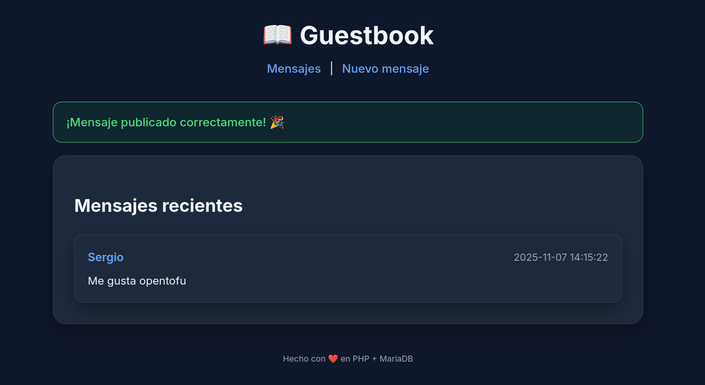

# Proyecto Integrado – Infraestructura como Código  
### Autor: Sergio Roales García

## Descripción  
Este proyecto corresponde a la asignatura **Proyecto Integrado**, bajo el título *Infraestructura como Código*.
Se ha desarrollado un escenario basado en **OpenTofu** (IaC) y **Ansible** para desplegar y configurar infraestructura de forma automatizada y reproducible.

## Estructura del repositorio  
- `terraform/` → Directorio que contiene los módulos de OpenTofu para aprovisionamiento de infraestructura.
- `escenarios/escenario3/` → Un escenario específico configurado para este proyecto.
- `ejemplos/` → Archivos de ejemplo que muestran la utilización de los módulos y plantillas.
- `README.md` → Este archivo de documentación que estás leyendo.

## Tecnologías empleadas  
- OpenTofu: herramienta de Infrastructure as Code utilizada para la definición de infraestructura en HCL.
- Ansible: herramienta de automatización para configuración de sistemas y despliegue de servicios.
- Lenguajes y entornos auxiliares: HCL, Shell, PHP, CSS, HTML, Jinja.

## Uso del proyecto  
1. Clona el repositorio:
   ```bash
   git clone https://github.com/xs3rgii/proyecto-pi.git
   cd proyecto-pi
2. Para iniciar el proyecto:
   ```bash
   cd escenarios/escenario3
   tofu init
   tofu apply
   ansible-playbok site.yaml
3. Pagina principal


4. Escenario

